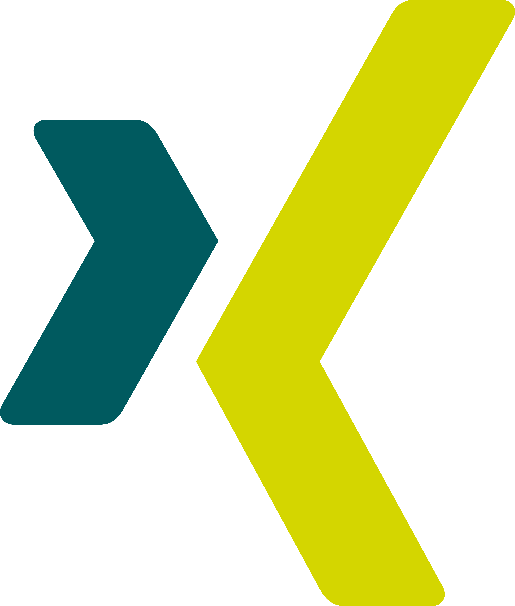

## Hi there! I'm Constantin

### I’m a language nerd who loves coding.

I come from a humanities background, namely political science,
economics, and languages. Since 2017 I’ve been in the software
development world, specifically machine learning and data engineering.
I moved from student to project manager and finally landed on
developer.

My motto is to never stop learning. This is why in spring 2022 I
pivoted towards web development and this is my current focus.

<!--- I’m looking forward to working on your next project! --->

### Feel free to reach out!

&nbsp;&nbsp;&nbsp;

### Some stats (and more to come)

